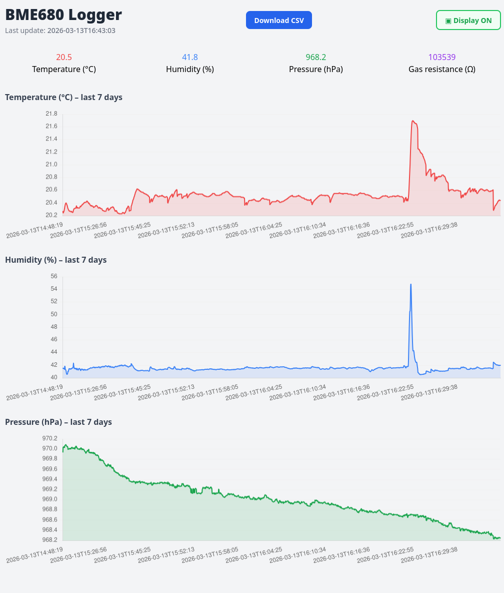

# bme680-logger

Log data from an I²C-connected **BME688** sensor every 5 minutes, display it on an OLED screen and serve a simple web interface.



## Features

| #   | Feature                                                                                            |
|-----|----------------------------------------------------------------------------------------------------|
| F1  | Sensor data logged every 5 minutes to a daily CSV file                                             |
| F2  | Web interface shows current readings and a 7-day history chart                                     |
| F3  | Raw CSV download from the web interface                                                            |
| F4  | A new log file is created automatically each day                                                   |
| F5  | Runs as a `systemd` service with automatic restart on failure                                      |
| F6  | OLED (I²C, address `0x3C`) shows current temperature, humidity, pressure and gas resistance        |
| F7  | Web interface toggle to turn the OLED on or off                                                    |
| F8  | OLED is only active during configurable daylight hours (default 08:00–22:00)                       |
| F9  | IAQ (Indoor Air Quality) score calculated from gas resistance and humidity with a burn-in phase    |
| F10 | Configurable OLED display mode: temperature/humidity, IAQ only, or cycling between both per minute |

## Hardware

* Raspberry Pi (any model with I²C)
* Pimoroni **BME688** breakout (I²C address `0x76` primary)
* 128×64 SSD1306 OLED display (I²C address `0x3C`)

## BME680 vs BME688

The **BME688** is the successor to the BME680.  Both sensors measure temperature, pressure, humidity and gas resistance, but the BME688 adds:

| Feature                  | BME680             | BME688                                   |
|--------------------------|--------------------|------------------------------------------|
| Gas sensor scanning      | Single fixed point | Multiple configurable scan points        |
| AI / pattern recognition | ❌                  | ✅ (via Bosch BSEC 2.x library)           |
| Gas sensor resolution    | 18-bit             | 20-bit                                   |
| Backward compatibility   | –                  | Pin- and software-compatible with BME680 |

This project uses the Pimoroni `bme680` Python library which is **fully compatible with both devices**.  The IAQ score implemented here is a simplified approximation based on gas-resistance baseline and humidity deviation; it does not require the Bosch BSEC library.

## Prerequisites

The required Python libraries are bundled in the Pimoroni virtualenv:

```
~/.virtualenvs/pimoroni/
```

Enable I²C on the Pi:

```bash
sudo raspi-config  # Interface Options → I2C → Enable
```

## Installation

```bash
# 1. Clone the repository
git clone https://github.com/doofmars/bme680-logger.git /home/pi/bme680-logger
cd /home/pi/bme680-logger

# 2. Install Flask into the Pimoroni venv (other libs are already present)
~/.virtualenvs/pimoroni/bin/pip install Flask>=2.3

# 3. Install the systemd service
sudo cp bme680-logger.service /etc/systemd/system/
sudo systemctl daemon-reload
sudo systemctl enable bme680-logger
sudo systemctl start bme680-logger

# 4. Copy/rename the sample config
cp config.ini-sample config.ini
```

## Configuration

Edit `config.ini` before starting the service:

```ini
[logging]
log_dir = logs            # Directory for daily CSV files
interval_seconds = 300    # Logging interval (seconds)

[display]
daylight_start = 8        # Hour the OLED turns on  (0-23)
daylight_end   = 22       # Hour the OLED turns off (0-23)
# What to show on the OLED screen:
#   temp_hum – temperature and humidity
#   iaq      – IAQ score and quality label
#   cycle    – alternate between the two views every minute (default)
display_mode = cycle

[web]
host = 0.0.0.0
port = 8080
```

## Usage

Open `http://<raspberry-pi-ip>:8080` in a browser.

| Path                  |   | Description                                                         |
|-----------------------|:--|---------------------------------------------------------------------|
| `/`                   |   | Dashboard – current readings, 7-day chart, display toggle           |
| `/download`           |   | Download today's CSV file                                           |
| `/api/current`        |   | JSON – latest sensor reading (includes `iaq` field)                 |
| `/api/history?days=7` |   | JSON – last *N* days of readings                                    |
| `/api/display`        |   | GET / POST – query or set display state (`{"enabled": true/false}`) |

## IAQ (Indoor Air Quality)

The IAQ score is computed using a simplified version of the Bosch reference algorithm:

* The gas sensor runs a **~50-second burn-in** phase on startup to establish a stable resistance baseline.
* **Humidity** contributes 25 % of the score (ideal ~40 % RH).
* **Gas resistance** contributes 75 % of the score (higher resistance = cleaner air).
* The combined 0–100 score is mapped to the 0–500 AQI-style range (lower is better).

| IAQ range | Category                     |
|-----------|------------------------------|
| 0 – 50    | Good                         |
| 51 – 100  | Moderate                     |
| 101 – 150 | Unhealthy (sensitive groups) |
| 151 – 200 | Unhealthy                    |
| 201 – 300 | Very unhealthy               |
| 301 – 500 | Hazardous                    |

The `iaq` column in the CSV file will be empty until the burn-in phase completes.

## Log file format

Files are stored as `<log_dir>/bme688_YYYY-MM-DD.csv`:

```
timestamp,temperature,pressure,humidity,gas_resistance,iaq
2024-06-01T08:00:00,22.35,1013.25,54.12,45231.0,42
```

## Code structure

| File            | Responsibility                                     |
|-----------------|----------------------------------------------------|
| `config.py`     | Load and expose all settings from `config.ini`     |
| `sensor.py`     | BME688 sensor init, IAQ burn-in and readings       |
| `display.py`    | OLED init, view-mode logic and rendering           |
| `csv_logger.py` | Daily CSV file helpers                             |
| `web.py`        | Flask application and API routes                   |
| `main.py`       | Entry point: sensor loop thread + web server       |

## Running manually

```bash
~/.virtualenvs/pimoroni/bin/python main.py
```

## Running on port 80

By default, the service binds to port **8080**. 
Change the service to use the standard HTTP port 80:

Add `AmbientCapabilities` to the `[Service]` section of `bme680-logger.service`:

```ini
AmbientCapabilities=CAP_NET_BIND_SERVICE
```

Then set `port = 80` in `config.ini` and reload:

```bash
sudo systemctl daemon-reload
sudo systemctl restart bme680-logger
```
